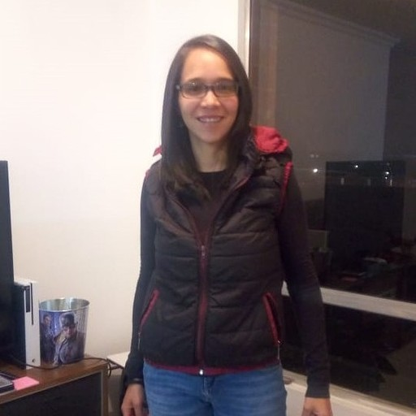
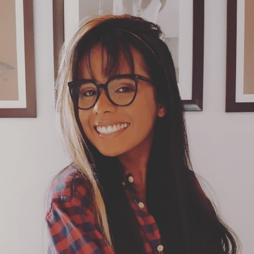
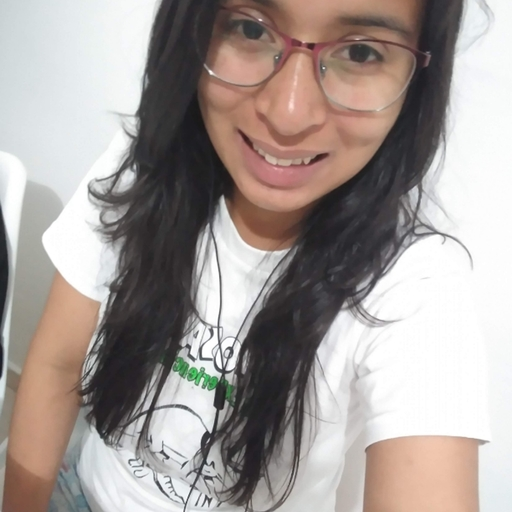

  

<a href="https://oriananohemi.github.io/SolSalud/#/">Demo del Proyecto</a>

## Según la asamblea mundial de la salud:
 
Las mujeres migrantes y desplazadas pueden tener un acceso limitado a la atención de salud sexual y reproductiva y pueden encontrarse expuestas a amenazas específicas para sus derechos conexos. Muchas mujeres migrantes o refugiadas no reciben atención prenatal o la reciben con retraso a causa de los obstáculos financieros en los hospitales, de la falta de derivación de los casos a ginecólogos, o del miedo, en particular a ser señaladas ante las autoridades y por motivos de vergüenza.

La migración internacional da lugar a diferencias en los resultados en materia de salud perinatal entre las mujeres migrantes y las nacidas en los países de recepción, así como entre distintos grupos de migrantes. Las mujeres están especialmente expuestas al riesgo de violencia sexual y otras formas de violencia de género, maltrato y trata de personas. 

<a href="https://apps.who.int/gb/ebwha/pdf_files/WHA72/A72_25-sp.pdf">Enlace Asamblea Mundial de la Salud </a>

## Nuestro Propósito

SolSalud nace de la iniciativa de unir a todos aquellos medicos y psicologos que aún creen que la salud es un derecho humano primordial, que saben que las enfermedades no conocen de fronteras ni niveles económicos, y que quieran ser voluntarios para ayudar a aquellas mujeres que mas lo necesitan.

En una primera etapa unimos a especialistas de la salud con las mujeres que necesitan acceder a salud de calidad, en una siguiente iteracion queremos llevarlo mas alla, creando una funcionalidad de gofundme para los tratamientos que nuestras mujeres llegaran a necesitar.

        

### Prototipo de alta fidelidad 

<a href="https://www.figma.com/proto/TUODEUsaV73a5wS2t98rpf/Hackathon-Laboratoria?node-id=63%3A67&scaling=scale-down">Demo Figma</a>

### Colaboradores

<figure>
   
  <figcaption>
    <a href="https://github.com/Sthephany04">Sthephany Granados</a>
  </figcaption>
</figure><figure>
  
  <figcaption>
    <a href="https://github.com/soydulceangelina">Dulce Mercado</a>
  </figcaption>
</figure><figure>
 
  <figcaption>
    <a href="https://github.com/oriananohemi">Oriana Reina</a>
  </figcaption>
</figure>

### Proyecto Realizado para Hackeando la Desigualdad - Laboratoria 2020

  

